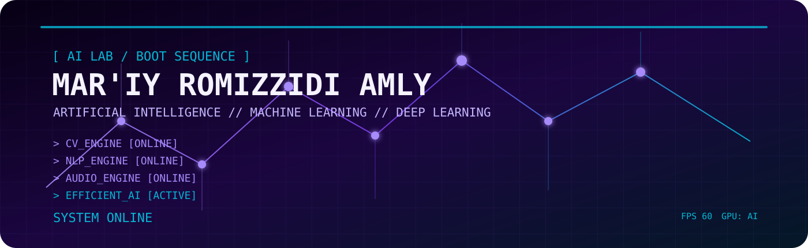
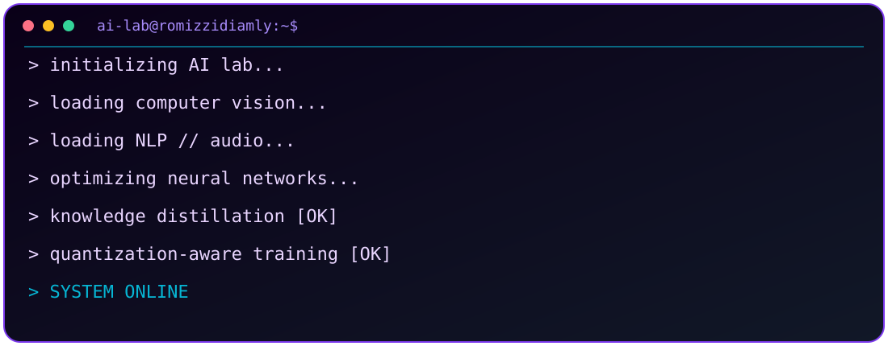
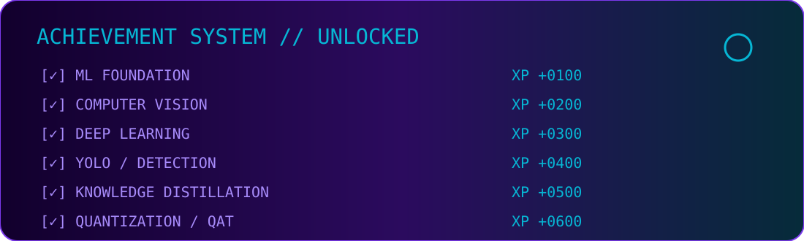
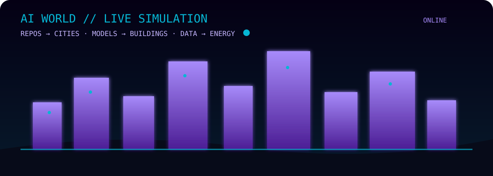
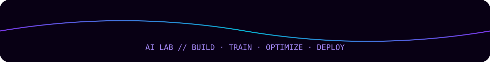

# MAR'IY ROMIZZIDI AMLY

### `AI / MACHINE LEARNING / DEEP LEARNING`

---

## `SYSTEM BOOT`

| MODULE | STATUS | DOMAIN |
|---|---|---|
| `ML-CORE` | `ONLINE` | Regression · Classification · Optimization |
| `CV-ENGINE` | `ONLINE` | Image Processing · Detection · YOLO · 2D/3D Vision |
| `NLP-STACK` | `ONLINE` | Text · Embeddings · Transformers · LLMs |
| `AUDIO-ENGINE` | `ONLINE` | Spectrograms · Classification · Speech |
| `EFF-AI` | `ACTIVE` | KD · Quantization · QAT · Lightweight Networks |
| `MULTIMODAL` | `LOADING` | Vision · Language · Audio |

---

## `ACHIEVEMENT UNLOCKED`

---

## `AI WORLD // LIVE`

---

## `MISSION CONTROL`

<table>
<tr>
<td align="center"><b>01 DATA</b> Collect Clean Augment</td>
<td align="center"><b>02 MODEL</b> Build Train Fine-tune</td>
<td align="center"><b>03 TEST</b> Validate Measure Explain</td>
<td align="center"><b>04 OPTIMIZE</b> KD QAT Prune</td>
<td align="center"><b>05 DEPLOY</b> Edge Efficient Monitor</td>
</tr>
</table>

---

## `GITHUB ARCADE`

### `PAC-MAN MODE`

<picture>
  <source media="(prefers-color-scheme: dark)" srcset="https://raw.githubusercontent.com/romizzidiamly/romizzidiamly/output/pacman-contribution-graph-dark.svg">
  <source media="(prefers-color-scheme: light)" srcset="https://raw.githubusercontent.com/romizzidiamly/romizzidiamly/output/pacman-contribution-graph.svg">
  
</picture>

### `BREAKOUT MODE`

<picture>
  <source media="(prefers-color-scheme: dark)" srcset="https://raw.githubusercontent.com/romizzidiamly/romizzidiamly/output/breakout-contribution-graph-dark.svg">
  <source media="(prefers-color-scheme: light)" srcset="https://raw.githubusercontent.com/romizzidiamly/romizzidiamly/output/breakout-contribution-graph.svg">
  
</picture>

### `SNAKE MODE`

<picture>
  <source media="(prefers-color-scheme: dark)" srcset="https://raw.githubusercontent.com/romizzidiamly/romizzidiamly/output/github-snake-dark.svg">
  <source media="(prefers-color-scheme: light)" srcset="https://raw.githubusercontent.com/romizzidiamly/romizzidiamly/output/github-snake.svg">
  
</picture>

---

## `BOSS FIGHT // EFFICIENT AI`

<table>
<tr>
<td align="center"><b>TEACHER</b> Dense CNN / Transformer</td>
<td align="center"><b>KD</b> Knowledge Transfer</td>
<td align="center"><b>STUDENT</b> Lightweight Network</td>
<td align="center"><b>QAT</b> Feature Preservation</td>
<td align="center"><b>EDGE</b> Efficient Inference</td>
</tr>
</table>

Focus areas:

- Quantization-aware training
- Feature-preserving distillation
- Lightweight CNNs
- Efficient inference
- Edge AI
- Resource-constrained deployment

---

## `FEATURED PROJECTS`

---

## `TECH STACK`

**Machine Learning:** Regression · Classification · Feature Engineering · Evaluation · Regularization · Optimization

**Deep Learning:** CNN · RNN · LSTM · GRU · Transfer Learning · Transformers · Knowledge Distillation · Quantization · QAT

**Computer Vision:** OpenCV · Image Processing · Feature Extraction · YOLO · Detection · Classification · 2D/3D Vision

**NLP & Audio:** Text Classification · Embeddings · Sequence Models · Transformers · Spectrograms · Speech Processing

---

## `3D CONTRIBUTION TERRAIN`

---

## `PLAYER STATS`

| STAT | CURRENT FOCUS |
|---|---|
| `AI LEVEL` | Machine Learning → Deep Learning |
| `VISION` | Detection · Classification · Image Processing |
| `LANGUAGE` | Python |
| `OPTIMIZATION` | KD · QAT · Quantization |
| `DEPLOYMENT` | Resource-efficient / Edge AI |
| `NEXT UNLOCK` | Multimodal AI |

---

## `GITHUB STATS`

 

---

### `SYSTEM ONLINE // KEEP BUILDING`

