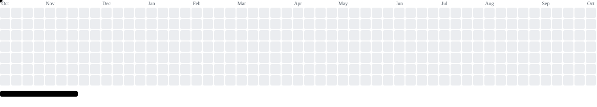
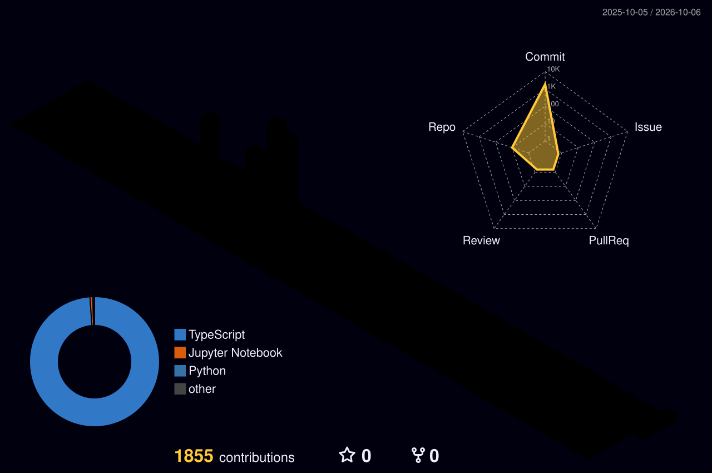

<div align="center">

<!-- ═══════════════════════════════════════════════════════════════════════ -->
<!--                         CINEMATIC HERO                                  -->
<!-- ═══════════════════════════════════════════════════════════════════════ -->

<a href="https://github.com/romizzidiamly">

</a>


<br>


</div>

---

<div align="center">

### `╔══════════════════════════════════════════════╗`
### `║        AI RESEARCH TERMINAL // 01           ║`
### `╚══════════════════════════════════════════════╝`

</div>

<table>
<tr>
<td width="62%" valign="top">

## `> boot_sequence`

```text
[✓] Python environment
[✓] Machine Learning
[✓] Deep Learning
[✓] Computer Vision
[✓] Experimental pipelines
[→] NLP / Transformers
[→] Audio intelligence
[→] Efficient AI
[→] Multimodal systems
```

I’m **Mar'iy Romizzidi Amly**, an AI/ML enthusiast exploring how intelligent systems learn from data.

My approach:

**QUESTION → EXPERIMENT → EVIDENCE → ANALYSIS → IMPROVEMENT**

</td>

<td width="38%" align="center" valign="middle">


<br><br>

```text
STATUS
━━━━━━━━━━━━━━
● AI LAB       ONLINE
● EXPERIMENT   ACTIVE
● GPU          READY
● RESEARCH     ONGOING
```

</td>
</tr>
</table>

---

<div align="center">

## `02 // CHOOSE YOUR AI LEVEL`

</div>

<table>
<tr>
<td align="center" width="25%">

### 🧠 LEVEL 01

**MACHINE LEARNING**

Regression  
Classification  
Feature Engineering  
Optimization

</td>

<td align="center" width="25%">

### ⚡ LEVEL 02

**DEEP LEARNING**

CNN  
RNN / LSTM / GRU  
Transfer Learning  
Transformers

</td>

<td align="center" width="25%">

### 👁️ LEVEL 03

**VISION**

OpenCV  
Feature Extraction  
Classification  
Object Detection

</td>

<td align="center" width="25%">

### 💬 LEVEL 04

**LANGUAGE**

NLP  
Embeddings  
Sequence Models  
LLMs

</td>
</tr>
</table>

<div align="center">

`🎧 AUDIO` &nbsp;&nbsp; `🌐 MULTIMODAL` &nbsp;&nbsp; `⚙️ EFFICIENT AI` &nbsp;&nbsp; `🚀 DEPLOYMENT`

</div>

---

<div align="center">

## `03 // AI WORLD`

</div>

<p align="center">

</p>

<div align="center">

**Your commits become buildings. Your repositories become cities.**

</div>

---

<div align="center">

## `04 // MISSION MAP`

</div>

<table>
<tr>
<td align="center" width="20%">

### 🗃️ DATA

Image  
Text  
Audio  
Tabular

</td>
<td align="center" width="5%"><b>◆</b></td>
<td align="center" width="20%">

### 🧬 MODEL

ML  
CNN  
RNN  
Transformer

</td>
<td align="center" width="5%"><b>◆</b></td>
<td align="center" width="20%">

### 🔬 TEST

F1  
AUC  
FLOPs  
Latency

</td>
<td align="center" width="5%"><b>◆</b></td>
<td align="center" width="20%">

### ⚙️ OPTIMIZE

QAT  
KD  
Compression  
Edge AI

</td>
</tr>
</table>

<div align="center">

`DATA` &nbsp; ◆ &nbsp; `MODEL` &nbsp; ◆ &nbsp; `TEST` &nbsp; ◆ &nbsp; `OPTIMIZE` &nbsp; ◆ &nbsp; `DEPLOY`

</div>

---

<div align="center">

## `05 // FEATURED MISSIONS`

</div>

<p align="center">

<a href="https://github.com/romizzidiamly/Student-Performance-Regression">

</a>

<a href="https://github.com/romizzidiamly/CardioPulse-CNN">

</a>

<br>

<a href="https://github.com/romizzidiamly/computer-vision-project">

</a>

<a href="https://github.com/romizzidiamly/animal-voice-classification">

</a>

</p>

---

<div align="center">

## `06 // BOSS FIGHT: EFFICIENT AI`

</div>

<table>
<tr>
<td width="50%" valign="top">

### `LARGE MODEL`

**Knowledge**

- rich representations
- high capacity
- expensive inference
- large compute requirements

</td>

<td width="50%" valign="top">

### `SMALL MODEL`

**Deployment**

- lightweight architecture
- lower latency
- lower memory
- edge-friendly inference

</td>
</tr>
</table>

<div align="center">

### `TEACHER` 🧠
### `↓`
### `KNOWLEDGE DISTILLATION`
### `↓`
### `STUDENT` ⚡
### `↓`
### `QUANTIZATION`
### `↓`
### `EDGE / EFFICIENT AI`

</div>

---

<div align="center">

## `07 // ANIMATED TERMINAL`

</div>

<p align="center">

</p>

---

<div align="center">

## `08 // GITHUB ARCADE`

### 🐍 SNAKE MODE

<picture>
<source media="(prefers-color-scheme: dark)" srcset="github-snake-dark.svg">
<source media="(prefers-color-scheme: light)" srcset="github-snake.svg">

</picture>

<br><br>

### 👾 PAC-MAN MODE

<picture>
<source media="(prefers-color-scheme: dark)" srcset="pacman-contribution-graph-dark.svg">
<source media="(prefers-color-scheme: light)" srcset="pacman-contribution-graph.svg">

</picture>

<br><br>

### 🧱 BREAKOUT MODE

<picture>
<source media="(prefers-color-scheme: dark)" srcset="breakout-contribution-graph-dark.svg">
<source media="(prefers-color-scheme: light)" srcset="breakout-contribution-graph.svg">

</picture>

</div>

---

<div align="center">

## `09 // 3D CONTRIBUTION TERRAIN`



</div>

---

<div align="center">

## `10 // LIVE GITHUB STATS`


<br>


</div>

---

<div align="center">

## `11 // ACHIEVEMENT UNLOCKED`


</div>

---

<div align="center">

## `12 // TECH LOADOUT`


<br><br>

`Python` · `PyTorch` · `TensorFlow` · `OpenCV` · `Scikit-learn`

`NumPy` · `Pandas` · `Matplotlib` · `YOLO` · `Jupyter` · `LaTeX`

</div>

---

<div align="center">

## `13 // PLAYER STATS`

<table>
<tr>
<td align="center"><b>VISION</b><br>████████████████░░░░</td>
<td align="center"><b>DEEP LEARNING</b><br>███████████████░░░░░</td>
</tr>
<tr>
<td align="center"><b>NLP</b><br>███████████░░░░░░░░░</td>
<td align="center"><b>EFFICIENT AI</b><br>████████████░░░░░░░░</td>
</tr>
</table>

<sub>Learning trajectory only — not a proficiency score.</sub>

</div>

---

<div align="center">

## `14 // FINAL BOSS`

### **DON'T JUST TRAIN THE MODEL.**
### **UNDERSTAND THE MODEL.**

<br>

`LEARN` → `BUILD` → `TRAIN` → `EVALUATE` → `UNDERSTAND` → `IMPROVE`

<br><br>


</div>
